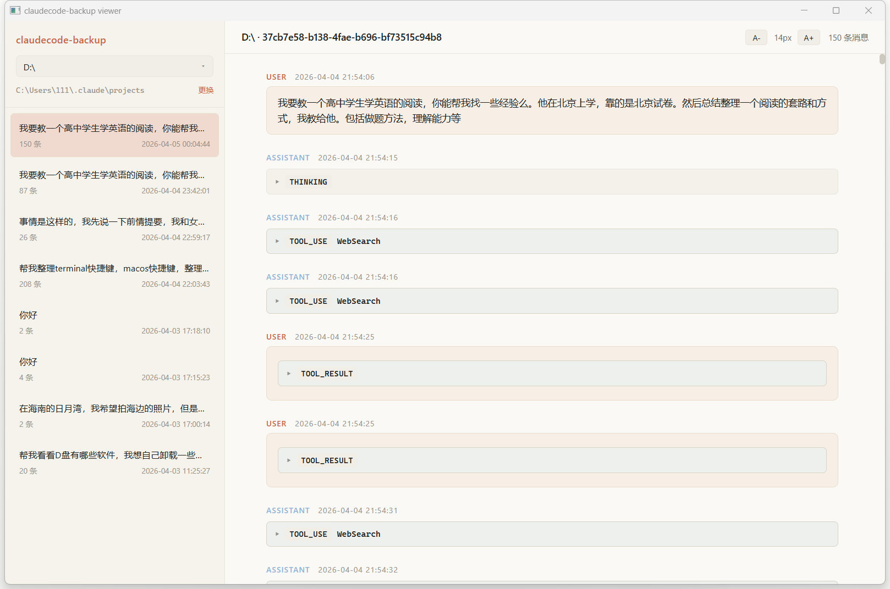

# claudecode-backup

> 🇨🇳 **中文版**（你现在看的） · [🇬🇧 English](README.en.md)

**claudecode-backup** 是一套围绕 [Claude Code](https://claude.com/claude-code) 对话历史的工具：

1. 实时备份 / 导出 / 导入 / 跨电脑迁移 `~/.claude/projects/` 里的 jsonl 会话
2. 自带一个 Claude.ai 风格的浅色 GUI 查看器（PySide6 + WebEngine），可以像聊天一样浏览历史



---

## 快速上手

### 用 GUI 查看器（最常用）

打包好的 Windows 单目录分发：双击 `claudecode-backup-viewer.exe` 即可。第一次打开如果默认 `~/.claude/projects/` 找不到，点左侧"更换"指你的实际路径。

从源码运行：

```bash
pip install -e .
claudecode-backup app
```

### 用 CLI 子命令

```bash
claudecode-backup list                       # 列出所有项目和会话
claudecode-backup watch D:\backups\claude    # 实时镜像到备份目录
claudecode-backup export --all -o backup.zip # 全量导出 zip
claudecode-backup export --project G--backup --format md -o ./out
claudecode-backup import backup.zip --remap-path "G:\backup=D:\new"
claudecode-backup serve                      # 浏览器版查看器（HTTP）
claudecode-backup app                        # 桌面版查看器（推荐）
```

---

## GUI 查看器

| 功能 | 说明 |
|------|------|
| 项目切换 | 左上角下拉框，按字母序列出全部项目 |
| 会话切换 | 左侧栏点击，按修改时间倒序 |
| 字号调节 | 右上角 `A- 14px A+`，11–22 px，localStorage 持久化 |
| 跳转图片 | 含图会话顶部出现 `📷 N 张图`，点一下跳下一张 |
| 切换数据源 | 左侧栏"更换"链接，弹 Windows 文件夹对话框，选完写入 `%APPDATA%\claudecode-backup\config.json` |
| 折叠卡片 | THINKING / TOOL_USE / TOOL_RESULT 默认折叠，点击展开 |
| 代码高亮 | highlight.js（atom-one-light） |
| Markdown | marked.js + GFM 表格 / 列表 / 引用 |

### 设计要点

- **只读**：API 全是 `GET`，没有修改源数据的入口
- **离线**：marked.js 和 highlight.js 已经 vendored 进 `static/vendor/`，无需联网
- **零端口**：用 `app://` 自定义 URL scheme，Python 直接服务请求，不走 socket
- **原生窗口**：close 按钮直接关程序，没有 Edge `--app` 那种心跳监听 hack

---

## 安装

需要 Python ≥ 3.9。

```bash
git clone <repo>
cd claudecode-backup
pip install -e .
```

依赖：`typer` / `rich` / `watchdog` / `flask` / `PySide6`

---

## CLI 子命令详解

### `list` 列出所有项目

```bash
claudecode-backup list
```

输出表格：项目目录、原始 cwd、会话数、消息总数、最后更新时间。

### `watch` 实时备份

```bash
claudecode-backup watch D:\backups\claude
```

启动时先全量同步一次，之后用 watchdog 监听 `~/.claude/projects/` 的增量改动，写到备份目录。`Ctrl+C` 退出。可以放进任务计划开机自启。

### `export` 导出会话

```bash
# 全量打包成 zip（jsonl 原样，最适合再导回）
claudecode-backup export --all -o claude-backup-2026-04-30.zip

# 单项目导出 Markdown 目录（按时间渲染）
claudecode-backup export --project "G:\backup" --format md -o ./out

# 单项目渲染 HTML
claudecode-backup export --project G--backup --format html -o ./out --zip
```

`--project` 接受三种形式：
- 编码后的目录名（`G--backup`）
- 原始路径（`G:\backup`）
- 任意 jsonl 所在目录的绝对路径

`-o` 后缀是 `.zip` 时自动启用打包。

### `import` 跨电脑还原

```bash
claudecode-backup import backup.zip \
  --remap-path "G:\backup=D:\projects\backup"
```

`--remap-path` 同时改两件事：
1. 每个 jsonl 事件里 `cwd` 字段的前缀替换
2. 顶层目录名（按 Claude Code 编码规则把 `G:\backup` 转成 `G--backup`）

可以多次 `--remap-path`。

### `serve` 浏览器版查看器

```bash
claudecode-backup serve --port 8765
```

启动 Flask 本地服务，浏览器自动打开，跟 `app` 一样的 UI 但走 HTTP，可以局域网访问（`--host 0.0.0.0`）。

### `app` 桌面版查看器（推荐）

```bash
claudecode-backup app
claudecode-backup app --project F--EMG-filiter-Predict
claudecode-backup app --width 1600 --height 1000
```

PySide6 + QtWebEngine 原生窗口，零端口，关窗口即结束。

---

## 打包成 .exe

需要先 `pip install pyinstaller`，然后：

```bash
pyinstaller claudecode-backup-viewer.spec
```

产出在 `dist/claudecode-backup-viewer/`（约 460 MB，主要是 PySide6 + Chromium 运行时）。整个目录拷给别人即可。

> **不要**用 `--onefile` 模式 —— QtWebEngine 的 `QtWebEngineProcess.exe` 在临时解压目录里找不到资源，闪退。

---

## 文件位置

| 路径 | 作用 |
|------|------|
| `%USERPROFILE%\.claude\projects\` | Claude Code 默认数据源 |
| `%APPDATA%\claudecode-backup\config.json` | 用户配置（持久化的 projects_dir 等） |
| `dist\claudecode-backup-viewer\` | PyInstaller 打包产物 |

GUI 启动时的解析顺序：`--projects-dir` 命令行参数 ＞ config.json 的持久化路径 ＞ 默认 `~/.claude/projects/`。

---

## 常见问题

**Q: 它会修改我的对话历史吗？**
不会。所有 GUI / CLI 子命令里只有 `import` 会写到目标目录（这是它的本职），其他全部只读。

**Q: 会发请求到外网吗？**
不会。所有静态资源（marked.js、highlight.js）都 vendored 在本地。

**Q: 包 460 MB 太大了？**
PySide6 + Chromium 运行时本身就这么大。如果接受 Edge / Chrome 应用窗口模式的少许折衷，可以改用 [`window.py`](claudecode_backup/viewer/window.py)（依赖系统装的 Edge / Chrome），打出来 30 MB 上下。

**Q: 中文路径会乱码吗？**
不会。所有文件 IO 都按 UTF-8 处理。

---

## 许可

MIT
